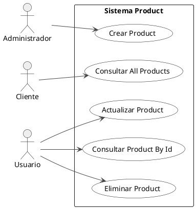
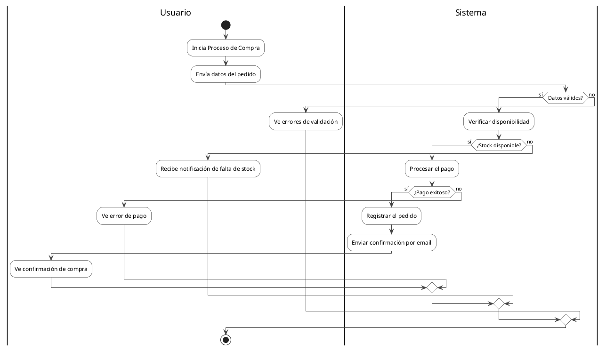

# Ejemplos de uso de los convertidores

## Convertidor de Casos de Uso

### Código C# de entrada:
```csharp
[ApiController]
[Route("api/products")]
public class ProductController : ControllerBase
{
    // @Actor: Cliente -> GetAllProducts
    [HttpGet]
    public IActionResult GetAllProducts()
    {
        return Ok();
    }
    
    [HttpGet("{id}")]
    public IActionResult GetProductById(int id)
    {
        return Ok();
    }
    
    // @Actor: Administrador -> CreateProduct
    [HttpPost]
    public IActionResult CreateProduct(ProductDto product)
    {
        return Ok();
    }
    
    [HttpPut("{id}")]
    public IActionResult UpdateProduct(int id, ProductDto product)
    {
        return Ok();
    }
    
    [HttpDelete("{id}")]
    public IActionResult DeleteProduct(int id)
    {
        return Ok();
    }
}
```

### Resultado PlantUML:


## Convertidor de Actividades

### Código C# de entrada:
```csharp
public class OrderController : ControllerBase
{
    // @Activity: Proceso de Compra
    public ActionResult ProcessOrder(OrderViewModel order)
    {
        // @User: Envía datos del pedido
        
        if (!ModelState.IsValid)
        {
            // @User: Ve errores de validación
            return View("ValidationError", ModelState);
        }
        
        // @System: Verifica disponibilidad de stock
        var stockAvailable = _inventoryService.CheckAvailability(order.ProductId, order.Quantity);
        
        if (!stockAvailable)
        {
            // @User: Recibe notificación de falta de stock
            return View("OutOfStock");
        }
        
        // @System: Procesa el pago
        var paymentResult = _paymentService.ProcessPayment(order.PaymentInfo);
        
        if (paymentResult.IsSuccessful)
        {
            // @System: Registra el pedido
            _orderService.CreateOrder(order);
            
            // @System: Envía confirmación por email
            _emailService.SendConfirmation(order.CustomerEmail);
            
            // @User: Ve confirmación de compra
            return View("OrderConfirmation", order);
        }
        else
        {
            // @User: Ve error de pago
            return View("PaymentError", paymentResult.Message);
        }
    }
}
```

### Resultado PlantUML:


## Uso en el código:

```python
from app.application.services.converters.csharp.usecase_converter import CSharpUseCaseConverter
from app.application.services.converters.csharp.activity_converter import CSharpActivityConverter

# Para casos de uso
usecase_converter = CSharpUseCaseConverter()
usecase_plantuml = usecase_converter.convert(csharp_controller_code)

# Para actividades
activity_converter = CSharpActivityConverter()
activity_plantuml = activity_converter.convert(csharp_method_code)
```
