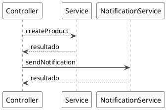
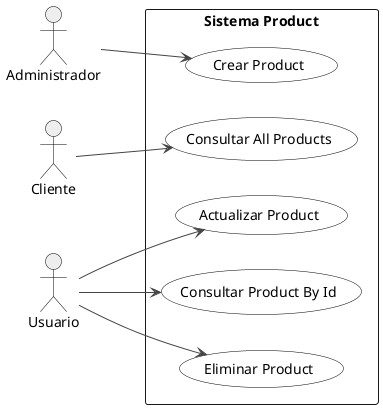
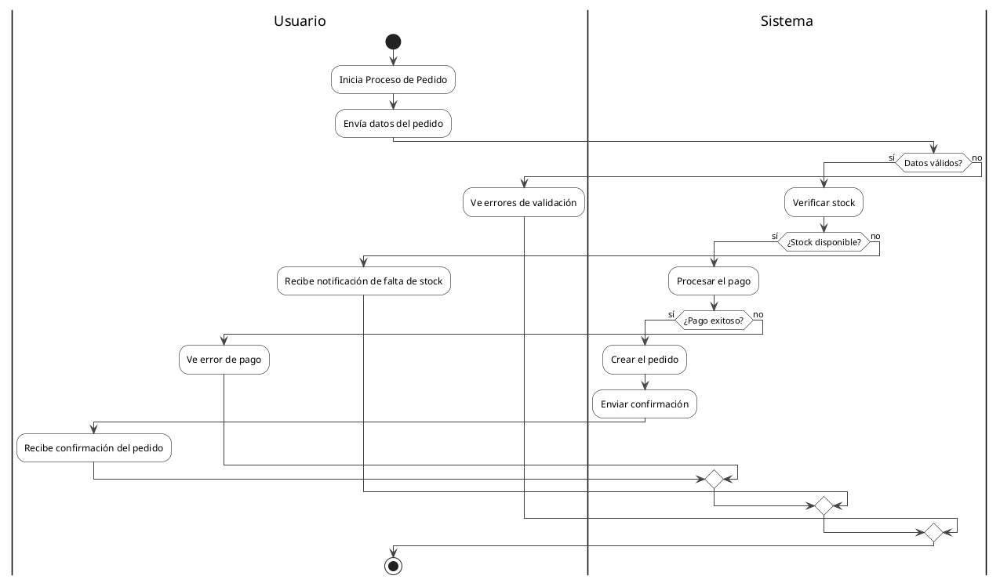

# Ejemplos de Convertidores Java

## Convertidor de Secuencia Java

### Código Java de entrada:
```java
@RestController
@RequestMapping("/api/products")
public class ProductController {
    
    @Autowired
    private ProductService productService;
    
    @Autowired
    private EmailService emailService;
    
    @PostMapping
    public ResponseEntity<Product> createProduct(@RequestBody ProductDto productDto) {
        Product product = productService.createProduct(productDto);
        emailService.sendNotification(product.getId());
        return ResponseEntity.ok(product);
    }
}
```

### Resultado PlantUML:


## Convertidor de Casos de Uso Java

### Código Java de entrada:
```java
@RestController
@RequestMapping("/api/products")
public class ProductController {
    
    // @Actor: Cliente -> getAllProducts
    @GetMapping
    public ResponseEntity<List<Product>> getAllProducts() {
        return ResponseEntity.ok(productService.findAll());
    }
    
    @GetMapping("/{id}")
    public ResponseEntity<Product> getProductById(@PathVariable Long id) {
        return ResponseEntity.ok(productService.findById(id));
    }
    
    // @Actor: Administrador -> createProduct
    @PostMapping
    public ResponseEntity<Product> createProduct(@RequestBody ProductDto productDto) {
        return ResponseEntity.ok(productService.create(productDto));
    }
    
    @PutMapping("/{id}")
    public ResponseEntity<Product> updateProduct(@PathVariable Long id, @RequestBody ProductDto productDto) {
        return ResponseEntity.ok(productService.update(id, productDto));
    }
    
    @DeleteMapping("/{id}")
    public ResponseEntity<Void> deleteProduct(@PathVariable Long id) {
        productService.delete(id);
        return ResponseEntity.noContent().build();
    }
}
```

### Resultado PlantUML:


## Convertidor de Actividades Java

### Código Java de entrada:
```java
@RestController
public class OrderController {
    
    // @Activity: Proceso de Pedido
    @PostMapping("/orders")
    public ResponseEntity<Order> processOrder(@RequestBody OrderDto orderDto) {
        // @User: Envía datos del pedido
        
        if (!orderService.validateOrder(orderDto)) {
            // @User: Ve errores de validación
            return ResponseEntity.badRequest().build();
        }
        
        // @System: Verifica stock disponible
        boolean stockAvailable = inventoryService.checkStock(orderDto.getProductId(), orderDto.getQuantity());
        
        if (!stockAvailable) {
            // @User: Recibe notificación de falta de stock
            return ResponseEntity.status(HttpStatus.CONFLICT).build();
        }
        
        // @System: Procesa el pago
        PaymentResult paymentResult = paymentService.processPayment(orderDto.getPaymentInfo());
        
        if (paymentResult.isSuccessful()) {
            // @System: Crea el pedido
            Order order = orderService.createOrder(orderDto);
            
            // @System: Envía confirmación
            emailService.sendOrderConfirmation(order.getCustomerEmail());
            
            // @User: Recibe confirmación del pedido
            return ResponseEntity.ok(order);
        } else {
            // @User: Ve error de pago
            return ResponseEntity.status(HttpStatus.PAYMENT_REQUIRED).build();
        }
    }
}
```

### Resultado PlantUML:


## Uso en el código:

```python
from app.application.services.converters.java.sequence_converter import JavaSequenceConverter
from app.application.services.converters.java.usecase_converter import JavaUseCaseConverter
from app.application.services.converters.java.activity_converter import JavaActivityConverter

# Para secuencia
sequence_converter = JavaSequenceConverter()
sequence_plantuml = sequence_converter.convert(java_controller_code)

# Para casos de uso
usecase_converter = JavaUseCaseConverter()
usecase_plantuml = usecase_converter.convert(java_controller_code)

# Para actividades
activity_converter = JavaActivityConverter()
activity_plantuml = activity_converter.convert(java_method_code)
```

## Características Java específicas:

### Anotaciones reconocidas:
- `@RestController`, `@Controller`
- `@GetMapping`, `@PostMapping`, `@PutMapping`, `@DeleteMapping`, `@PatchMapping`
- `@RequestMapping`
- `@Autowired`

### Patrones reconocidos:
- Servicios terminados en `Service` o `Repository`
- Métodos que retornan `ResponseEntity`
- Validaciones con métodos `validate`, `isValid`, `checkValid`
- Llamadas a servicios con sintaxis `service.method()`

### Convenciones:
- Nombres de métodos en camelCase
- Mapeo automático de verbos HTTP a acciones
- Detección de actores por palabras clave en nombres de métodos
- Uso de comentarios `@Actor`, `@Activity`, `@User`, `@System` para mayor control
