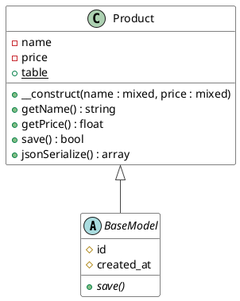
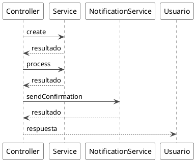
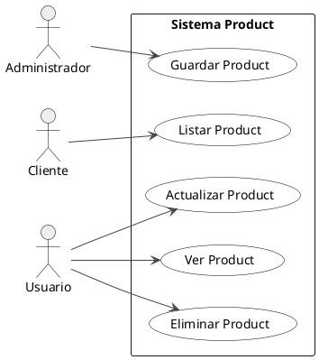
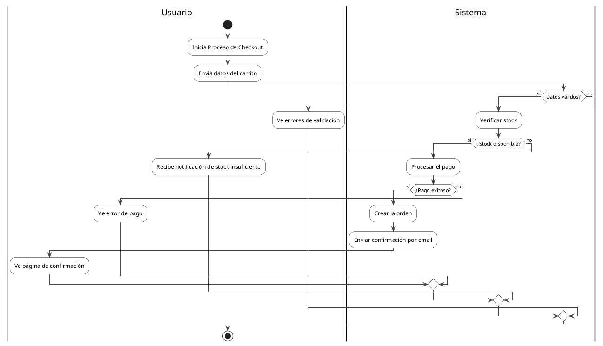

# Ejemplos de Convertidores PHP

## Convertidor de Clases PHP

### Código PHP de entrada:
```php
<?php

namespace App\Models;

abstract class BaseModel
{
    protected $id;
    protected $created_at;
    
    abstract public function save();
}

class Product extends BaseModel implements JsonSerializable
{
    private $name;
    private $price;
    public static $table = 'products';
    
    public function __construct($name, $price)
    {
        $this->name = $name;
        $this->price = $price;
    }
    
    public function getName(): string
    {
        return $this->name;
    }
    
    public function getPrice(): float
    {
        return $this->price;
    }
    
    public function save(): bool
    {
        // Implementation
        return true;
    }
    
    public function jsonSerialize(): array
    {
        return [
            'name' => $this->name,
            'price' => $this->price
        ];
    }
}
```

### Resultado PlantUML:


## Convertidor de Secuencia PHP

### Código PHP de entrada (Laravel):
```php
<?php

class OrderController extends Controller
{
    public function store(Request $request)
    {
        $data = $request->validated();
        
        $order = $this->orderService->create($data);
        $this->paymentService->process($order->id);
        $this->emailService->sendConfirmation($order->customer_email);
        
        return response()->json($order);
    }
}
```

### Resultado PlantUML:


## Convertidor de Casos de Uso PHP

### Código PHP de entrada (Laravel):
```php
<?php

class ProductController extends Controller
{
    // @Actor: Cliente -> index
    public function index()
    {
        return Product::all();
    }
    
    public function show($id)
    {
        return Product::findOrFail($id);
    }
    
    // @Actor: Administrador -> store
    public function store(Request $request)
    {
        return Product::create($request->validated());
    }
    
    public function update(Request $request, $id)
    {
        $product = Product::findOrFail($id);
        $product->update($request->validated());
        return $product;
    }
    
    public function destroy($id)
    {
        Product::findOrFail($id)->delete();
        return response()->noContent();
    }
}
```

### Resultado PlantUML:


## Convertidor de Actividades PHP

### Código PHP de entrada:
```php
<?php

class CheckoutController extends Controller
{
    /**
     * @Activity: Proceso de Checkout
     */
    public function process(Request $request)
    {
        // @User: Envía datos del carrito
        
        $validator = Validator::make($request->all(), $this->rules());
        
        if ($validator->fails()) {
            // @User: Ve errores de validación
            return back()->withErrors($validator);
        }
        
        // @System: Verifica stock disponible
        $stockCheck = $this->inventoryService->checkAvailability($request->items);
        
        if (!$stockCheck->available) {
            // @User: Recibe notificación de stock insuficiente
            return back()->with('error', 'Stock insuficiente');
        }
        
        try {
            // @System: Procesa el pago
            $payment = $this->paymentService->charge($request->payment_method);
            
            if ($payment->successful) {
                // @System: Crea la orden
                $order = $this->orderService->create($request->all());
                
                // @System: Envía confirmación por email
                $this->mailService->send(new OrderConfirmation($order));
                
                // @User: Ve página de confirmación
                return redirect()->route('order.success', $order->id);
            } else {
                // @User: Ve error de pago
                return back()->with('error', 'Error en el pago');
            }
        } catch (Exception $e) {
            // @User: Ve mensaje de error
            return back()->with('error', 'Error inesperado');
        }
    }
}
```

### Resultado PlantUML:


## Uso en el código:

```python
from app.application.services.converters.php.class_converter import PHPClassConverter
from app.application.services.converters.php.sequence_converter import PHPSequenceConverter
from app.application.services.converters.php.usecase_converter import PHPUseCaseConverter
from app.application.services.converters.php.activity_converter import PHPActivityConverter

# Para clases
class_converter = PHPClassConverter()
class_plantuml = class_converter.convert(php_class_code)

# Para secuencia
sequence_converter = PHPSequenceConverter()
sequence_plantuml = sequence_converter.convert(php_controller_code)

# Para casos de uso
usecase_converter = PHPUseCaseConverter()
usecase_plantuml = usecase_converter.convert(php_controller_code)

# Para actividades
activity_converter = PHPActivityConverter()
activity_plantuml = activity_converter.convert(php_method_code)
```

## Características PHP específicas:

### Frameworks soportados:
- **Laravel**: Controladores, Eloquent, métodos CRUD estándar
- **Symfony**: Controladores con anotaciones
- **PHP puro**: Clases y métodos estándar

### Sintaxis reconocida:
- Namespaces (`namespace App\Controllers;`)
- Clases abstractas y finales
- Interfaces y traits
- Propiedades con visibilidad (`public`, `private`, `protected`)
- Métodos estáticos (`public static function`)
- Constructores y destructores

### Patrones Laravel reconocidos:
- Métodos CRUD: `index`, `show`, `create`, `store`, `edit`, `update`, `destroy`
- Servicios inyectados: `$this->serviceNam->method()`
- Respuestas: `response()->json()`, `redirect()`, `back()`
- Validaciones: `Validator::make()`, `$request->validated()`

### Anotaciones y comentarios:
- `// @Actor: Actor -> metodo` para casos de uso
- `/** @Activity: Proceso */` en docblocks para actividades
- `// @Activity: Proceso` en comentarios para actividades
- `// @User:` y `// @System:` para cambio de swimlanes

### Detección automática:
- Controladores terminados en `Controller`
- Servicios terminados en `Service` o `Repository`
- Métodos que indican operaciones CRUD
- Validaciones y manejo de errores Laravel
- Llamadas a servicios con sintaxis `$object->method()`

### Convenciones PHP:
- Nombres en camelCase y snake_case
- Variables con prefijo `$`
- Mapeo automático de métodos Laravel a acciones
- Detección de tipos de respuesta (JSON, redirect, view)
- Análisis de excepciones y manejo de errores
