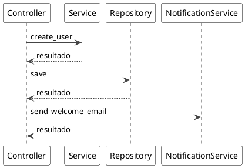
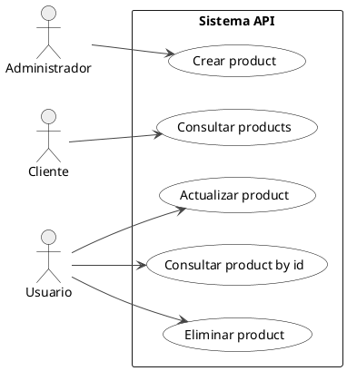
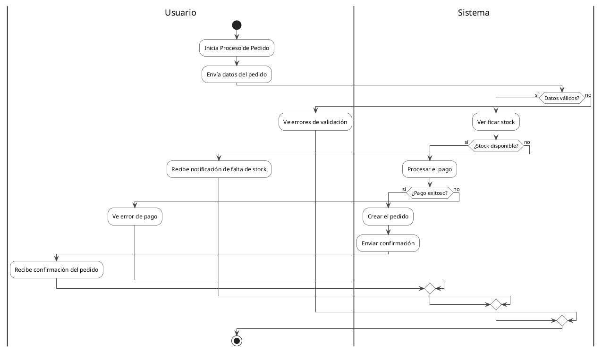

# Ejemplos de Convertidores Python

## Convertidor de Secuencia Python

### Código Python de entrada (Flask/FastAPI):
```python
from flask import Flask, request, jsonify

app = Flask(__name__)

class UserService:
    def create_user(self, user_data):
        return self.repository.save(user_data)

class EmailService:
    def send_welcome_email(self, user_id):
        pass

@app.route('/users', methods=['POST'])
def create_user():
    user_data = request.get_json()
    user = user_service.create_user(user_data)
    email_service.send_welcome_email(user.id)
    return jsonify(user)
```

### Resultado PlantUML:


## Convertidor de Casos de Uso Python

### Código Python de entrada (FastAPI):
```python
from fastapi import FastAPI, HTTPException

app = FastAPI()

# @Actor: Cliente -> get_products
@app.get("/products")
async def get_products():
    return product_service.get_all()

@app.get("/products/{product_id}")
async def get_product_by_id(product_id: int):
    return product_service.get_by_id(product_id)

# @Actor: Administrador -> create_product
@app.post("/products")
async def create_product(product: ProductCreate):
    return product_service.create(product)

@app.put("/products/{product_id}")
async def update_product(product_id: int, product: ProductUpdate):
    return product_service.update(product_id, product)

@app.delete("/products/{product_id}")
async def delete_product(product_id: int):
    product_service.delete(product_id)
    return {"message": "Product deleted"}
```

### Resultado PlantUML:


## Convertidor de Actividades Python

### Código Python de entrada:
```python
from flask import Flask, request, jsonify, render_template

app = Flask(__name__)

@app.route('/orders', methods=['POST'])
def process_order():
    """
    @Activity: Proceso de Pedido
    """
    # @User: Envía datos del pedido
    order_data = request.get_json()
    
    if not order_service.validate_order(order_data):
        # @User: Ve errores de validación
        return jsonify({"error": "Invalid order data"}), 400
    
    # @System: Verifica stock disponible
    stock_available = inventory_service.check_stock(
        order_data['product_id'], 
        order_data['quantity']
    )
    
    if not stock_available:
        # @User: Recibe notificación de falta de stock
        return jsonify({"error": "Insufficient stock"}), 409
    
    # @System: Procesa el pago
    payment_result = payment_service.process_payment(order_data['payment_info'])
    
    if payment_result.is_successful():
        # @System: Crea el pedido
        order = order_service.create_order(order_data)
        
        # @System: Envía confirmación
        email_service.send_order_confirmation(order.customer_email)
        
        # @User: Recibe confirmación del pedido
        return jsonify(order), 201
    else:
        # @User: Ve error de pago
        return jsonify({"error": "Payment failed"}), 402
```

### Resultado PlantUML:


## Uso en el código:

```python
from app.application.services.converters.python.sequence_converter import PythonSequenceConverter
from app.application.services.converters.python.usecase_converter import PythonUseCaseConverter
from app.application.services.converters.python.activity_converter import PythonActivityConverter

# Para secuencia
sequence_converter = PythonSequenceConverter()
sequence_plantuml = sequence_converter.convert(python_code)

# Para casos de uso
usecase_converter = PythonUseCaseConverter()
usecase_plantuml = usecase_converter.convert(python_api_code)

# Para actividades
activity_converter = PythonActivityConverter()
activity_plantuml = activity_converter.convert(python_function_code)
```

## Características Python específicas:

### Frameworks soportados:
- **Flask**: `@app.route()`, decoradores HTTP
- **FastAPI**: `@app.get()`, `@app.post()`, etc.
- **Django**: Métodos de vista basados en clases
- **General**: Cualquier código Python con funciones

### Patrones reconocidos:
- Decoradores de rutas (`@app.get`, `@app.post`, `@app.route`)
- Llamadas a métodos con notación punto (`service.method()`)
- Funciones que terminan en sufijos como `_service`, `_repository`
- Returns con `jsonify()`, `render_template()`, etc.

### Análisis inteligente:
- **AST (Abstract Syntax Tree)** para análisis preciso del código Python
- **Fallback a regex** si hay errores de sintaxis
- **Detección automática** de servicios, repositorios, APIs externas
- **Mapeo de actores** basado en convenciones de nombres

### Comentarios especiales:
- `# @Actor: NombreActor -> nombre_funcion` para casos de uso
- `# @Activity: Nombre del Proceso` para actividades
- `# @User: Descripción` y `# @System: Descripción` para cambio de swimlanes
- Docstrings con `@Activity:` también son reconocidos

### Convenciones Python:
- Nombres en snake_case
- Detección de funciones del sistema por palabras clave
- Mapeo automático de verbos HTTP a acciones en español
- Análisis de flujo de control (if/else, try/except, return)
